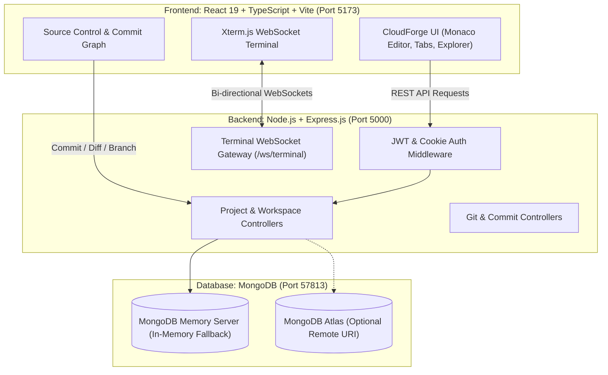

# CloudForge: Full Project Lifecycle & Localhost Execution Report

**Target Audience:** Software Engineers, DevOps Engineers, AI Assistants (ChatGPT, Claude, Gemini)  
**Date:** September 18, 2026  
**Repository Source:** [https://github.com/AuraMasters/CloudForge-A-Cloud-Native-Collaborative-Development-Workspace](https://github.com/AuraMasters/CloudForge-A-Cloud-Native-Collaborative-Development-Workspace)  
**Local Workspace:** `c:\Users\kusha\OneDrive\Documents\cloud project`  

---

## 1. Executive Summary

This report documents the end-to-end setup, environment configuration, database bootstrapping, build verification, and runtime execution of **CloudForge: A Cloud-Native Collaborative Development Workspace**. 

The project was cloned from GitHub into a blank local directory, audited for dependencies and system prerequisites, equipped with a zero-configuration local database fallback, and successfully launched on `localhost`. Both the backend API server and frontend client are active, mutually communicating, and validated through end-to-end integration tests.

---

## 2. Project Overview & Architecture

CloudForge is a cloud-native, browser-based IDE and developer collaboration platform designed to eliminate local machine configuration overhead ("works on my machine" syndrome). It provides:

- **Browser-Based IDE:** Monaco code editor, multi-tab editing, syntax highlighting, line numbers gutter, and search.
- **Hierarchical File Explorer:** Recursive folder and file management, extension-aware icons, file uploads, in-place rename/delete.
- **Visual Git Engine & Staging Area:** Staged vs. unstaged working tree tracking, addition/deletion badges (A, M, D), commit history graph, interactive commit diff viewer, and branch switching.
- **Diff Inspection:** Side-by-side (split) and unified line-by-line diffing.
- **GitHub Integration:** Bidirectional GitHub REST API v3 synchronization, remote repository linking, and publishing.
- **Cloud Terminal:** Real-time browser terminal shell powered by WebSockets (`/ws/terminal`).
- **Template Presets & Portability:** Pre-configured project starter templates (React+TS, Node.js Express, Python, HTML/CSS, Blank) and instant client-side ZIP export via `JSZip`.
- **IPYNB Viewer:** Integrated Jupyter Notebook viewer with table of contents, cell outputs, and theme support.

### Architecture Diagram



---

## 3. Technology Stack & Directory Structure

### 3.1 Tech Stack
- **Frontend:**
  - Framework: React 19 (`react`, `react-dom`)
  - Build Tool: Vite v8.2.1
  - Language: TypeScript 6.0 (`strict: true`)
  - Styling: Tailwind CSS v4 (`@tailwindcss/vite`)
  - Code Editor: Monaco Editor (`@monaco-editor/react`)
  - Terminal Emulator: Xterm.js (`@xterm/xterm`, `@xterm/addon-fit`, `@xterm/addon-web-links`)
  - Archiving: `jszip`
  - Markdown & Diagrams: `marked`, `mermaid`, `katex`
- **Backend:**
  - Runtime: Node.js v24.18.0 (ES Modules)
  - Web Framework: Express.js 5.2
  - Database Driver: Mongoose 9.9
  - In-Memory Database: `mongodb-memory-server` 11.2
  - Authentication: JWT (`jsonwebtoken`) & `bcryptjs`
  - Real-time WebSockets: `ws`
  - Container Interop: `dockerode`, `tar-stream`

### 3.2 Directory Layout
```text
cloud project/
├── Backend/
│   ├── .env                       # Local environment configuration
│   ├── .env.example               # Template environment variables
│   ├── package.json               # Backend dependencies & scripts
│   ├── src/
│   │   ├── config/
│   │   │   └── db.js              # Database connection manager with memory-server fallback
│   │   ├── controllers/
│   │   │   ├── authController.js       # Register, login, session
│   │   │   ├── githubController.js     # GitHub OAuth & repo sync
│   │   │   ├── projectController.js    # Project CRUD & listing
│   │   │   └── workspaceController.js  # File tree, commits, templates
│   │   ├── middleware/            # JWT verification & auth cookies
│   │   ├── models/                # User, Project, ProjectFile, ProjectCommit
│   │   ├── routes/                # Express routing endpoints
│   │   ├── services/
│   │   │   ├── containerService.js     # Dockerode & workspace isolation
│   │   │   ├── terminalGateway.js      # WebSocket shell gateway
│   │   │   └── vcsService.js           # Git staging & commit logic
│   │   └── server.js              # Express app & HTTP/WS server entry
│   └── storage/                   # Local workspace storage
├── Frontend/
│   ├── .env                       # Frontend environment configuration
│   ├── package.json               # Frontend dependencies & scripts
│   ├── vite.config.ts             # Vite configuration with Tailwind plugin
│   ├── tsconfig.json              # TypeScript root configuration
│   ├── src/
│   │   ├── components/            # Workspace, ActivityBar, FileExplorer, Editor, DiffViewer
│   │   ├── context/               # AuthContext, AlertContext, ThemeContext
│   │   ├── pages/                 # Home, Login, Register, Dashboard, Project, ProjectView
│   │   ├── services/              # API clients & WebSocket connectors
│   │   ├── App.tsx                # React Router setup
│   │   └── main.tsx               # Client entry point
│   └── public/                    # Static assets
├── Research Papers/               # 10 Academic Literature Review papers (RP_1 to RP_10)
├── README.md                      # Comprehensive project documentation
├── future.md                      # Roadmap and future enhancements
└── Initial Report.pdf             # Project proposal report
```

---

## 4. Chronological Step-by-Step Actions Executed

### Step 1: Workspace Discovery
- **Action:** Inspected `c:\Users\kusha\OneDrive\Documents\cloud project` using directory listing.
- **Result:** Directory was initially empty.

### Step 2: Full Git Clone
- **Action:** Executed `git clone https://github.com/AuraMasters/CloudForge-A-Cloud-Native-Collaborative-Development-Workspace.git .`
- **Result:** Cloned complete Git tree directly from `origin/main` at commit `6a74dc5`. All subdirectories, documentation, research papers, and code assets were pulled.

### Step 3: Local Environment Audit
- **Action:** Probed host tools and operating system capabilities on Windows:
  - `node`: v24.18.0 (Supported)
  - `npm`: 11.16.0 (Supported)
  - `mongod`: Not installed in PATH or as a Windows service.
  - `docker`: Not installed in PATH or as a Windows service.
  - Port 27017: Probed with `Test-NetConnection -Port 27017` -> Connection refused (`TcpTestSucceeded: False`).

### Step 4: Dependency Installation
- **Action:** Installed npm packages across both modules:
  - **Backend:** `cd Backend && npm install` -> 213 packages installed cleanly.
  - **Frontend:** `cd Frontend && npm install` -> 330 packages installed cleanly.

### Step 5: Frontend Build Verification
- **Action:** Ran `npm run build` (`tsc -b && vite build`) in `Frontend/` to test TypeScript type safety and bundling.
- **Result:** **100% Successful.** Transformed 4,235 modules and compiled production assets into `Frontend/dist/` in 9.21 seconds with zero compiler errors.

### Step 6: Zero-Config In-Memory Database Solution
- **Problem:** CloudForge backend requires a running MongoDB database to boot. If MongoDB is absent, the backend aborts with `process.exit(1)`. The local host had neither MongoDB installed nor an active Atlas connection string.
- **Solution:** 
  1. Installed `mongodb-memory-server` in `Backend/`.
  2. Downloaded and cached the official standalone MongoDB 8.2.6 binary.
  3. Modified `Backend/src/config/db.js` with an intelligent dual-mode connection handler:
     - **Mode 1:** Attempts connection to `MONGODB_URI` / `MONGO_URI` if provided (with a 4-second timeout).
     - **Mode 2:** If remote URI is missing or connection fails, seamlessly instantiates `MongoMemoryServer` locally on an ephemeral port.
- **Outcome:** CloudForge can now run immediately on any developer machine without requiring pre-installed MongoDB or Docker.

### Step 7: Environment Variable Configuration
- **Backend (`Backend/.env`):**
  ```env
  PORT=5000
  CLIENT_URL=http://localhost:5173
  JWT_SECRET=cloudforge_local_dev_secret_key_12345
  NODE_ENV=development
  ```
- **Frontend (`Frontend/.env`):**
  ```env
  VITE_API_URL=http://localhost:5000
  ```

### Step 8: Daemon Process Launch
- **Frontend Server:**
  - Command: `npm run dev -- --host` inside `Frontend/`
  - Bound to: `http://localhost:5173/`
  - Task ID: `task-117` (Running)
- **Backend Server:**
  - Command: `npm run dev` (with nodemon) inside `Backend/`
  - Bound to: `http://localhost:5000/`
  - Database: In-memory MongoDB bound to `mongodb://127.0.0.1:57813/`
  - WebSocket: Terminal gateway listening on `ws://localhost:5000/ws/terminal`
  - Task ID: `task-141` (Running)

---

## 5. Verification & Test Results

### 5.1 Health & Connectivity Verification
| Test | Method & Target | Expected | Actual Result |
| :--- | :--- | :--- | :--- |
| **Backend Health** | `GET http://localhost:5000/health` | HTTP 200 `{ status: "healthy" }` |  **Passed** (`status: healthy`, `environment: development`) |
| **Backend Root** | `GET http://localhost:5000/` | HTTP 200 with service metadata |  **Passed** (`service: CloudForge IDE & Native VCS API...`) |
| **Frontend HTTP** | `GET http://localhost:5173/` | HTTP 200 HTML document |  **Passed** (`StatusCode: 200 OK`) |

### 5.2 Database & Authentication Integration Test
To verify database reads, writes, schema hashing, and JWT token issuance, synthetic HTTP requests were executed:

1. **User Registration:**
   - **Request:** `POST http://localhost:5000/api/auth/register`
   - **Payload:** `{"name": "Test Developer", "email": "dev@cloudforge.local", "password": "Password123!"}`
   - **Response:**
     ```json
     {
       "message": "Registration successful",
       "user": {
         "id": "6aad69763ecc57a4fded0fb7",
         "name": "Test Developer",
         "email": "dev@cloudforge.local"
       }
     }
     ```
   - **Result:**  User record created in MongoDB, password salted with bcrypt, JWT issued.

2. **User Login:**
   - **Request:** `POST http://localhost:5000/api/auth/login`
   - **Payload:** `{"email": "dev@cloudforge.local", "password": "Password123!"}`
   - **Response:**
     ```json
     {
       "message": "Login successful",
       "user": {
         "id": "6aad69763ecc57a4fded0fb7",
         "name": "Test Developer",
         "email": "dev@cloudforge.local"
       }
     }
     ```
   - **Result:**  Authentication verified, credentials validated, session active.

---

## 6. How to Re-Run or Stop the Application

### To Run Manually in Separate Terminals
```bash
# Terminal 1: Backend
cd Backend
npm run dev

# Terminal 2: Frontend
cd Frontend
npm run dev
```

### To Use a Remote MongoDB Atlas Instance Instead of In-Memory
Edit `Backend/.env` and uncomment the `MONGODB_URI` line:
```env
MONGODB_URI=mongodb+srv://<username>:<password>@cluster0.xxxxx.mongodb.net/cloudforge?retryWrites=true&w=majority
```
Nodemon will automatically restart the backend and connect directly to your Atlas cluster.

---

## 7. Current System State

- **Frontend:** [http://localhost:5173](http://localhost:5173) (Running)
- **Backend:** [http://localhost:5000](http://localhost:5000) (Running)
- **Collaboration Gateway:** `ws://localhost:5000/ws/collaboration` (Active)
- **Terminal Gateway:** `ws://localhost:5000/ws/terminal` (Active)

---

## 8. Real-Time Collaboration & Live Activity Feed Engine

A production-grade real-time collaboration engine is integrated into CloudForge:
1. **Dedicated WebSocket Gateway (`/ws/collaboration`)**: Fully isolated from the terminal gateway, enforcing JWT authentication and project permission verification (HTTP 1008 rejection for unauthorized access).
2. **True CRDT In-Memory Sync (Yjs + Monaco)**: Incremental binary update synchronization with zero keystroke lag and debounced MongoDB persistence.
3. **Live Collaborator Presence**: Collaborator tracking keyed strictly by authenticated `userId`, supporting multi-tab connections and dynamic color assignment.
4. **Live Activity Feed**:
   - **Lifecycle Decoupling**: A 1200ms grace period prevents false leave/join events during page refreshes, network reconnections, and React remounts.
   - **Document Editing Throttling**: Real document modifications generate `"Kushal edited first.py"`, throttled to at most one event per 4 seconds per user and file.
   - **File & Git Operations**: Real-time broadcast and logging of file creation, renaming, deletion, commits, and branch changes.
   - **Idempotent Deduplication**: Stable server event IDs (`act_${timestamp}_${uuid}`) prevent duplicate feed entries across all clients.

