# CloudForge: Cloud-Native Collaborative Development Workspace

## 1. Introduction

CloudForge is a cloud-native, browser-based collaborative development platform designed to provide a complete software development environment without requiring extensive local configuration. It combines a browser-based IDE, isolated containerized workspaces, real-time collaboration, Git integration, cloud terminal access, and resource monitoring within a unified platform. 

Docker provides isolated and consistent development environments, while cloud-native orchestration supports scalable workspace management. The platform is designed for developers, educational institutions, and engineering teams that require accessible, standardized, and collaborative development environments without local machine configuration overhead.

---

## 2. Problem Statement

Traditional development environments require developers to install and configure programming languages, libraries, frameworks, IDEs, compilers, databases, and other dependencies locally. Differences in operating systems, hardware architectures, package versions, and environment variables frequently lead to dependency conflicts and inconsistent execution environments. Collaborative development also requires developers to switch between disparate tools for coding, version control, communication, terminal operations, execution, and deployment.

Existing cloud-based development solutions address several of these problems, but critical capabilities are often fragmented across separate systems. Collaborative editors primarily focus on concurrent text editing, container tools focus on environment isolation, and cloud IDE platforms focus on remote development. There is a need for a unified platform that combines isolated cloud workspaces, hierarchical file exploration, visual Git commit timelines, code execution, terminal access, and resource management into a single cohesive environment.

---

## 3. Objectives

* Develop a browser-based development environment accessible across diverse client devices and operating systems.
* Provide isolated, reproducible development workspaces using containerization principles.
* Eliminate dependency conflicts and machine-specific configuration discrepancies across developer environments.
* Enable seamless workspace navigation with a full-featured hierarchical file explorer and multi-tab code editor.
* Integrate visual Git operations directly into the development environment, including branch management, working tree diffing, commit history graphs, and GitHub synchronization.
* Provide a browser-accessible cloud terminal for workspace operations and task management.
* Monitor workspace resource consumption, including CPU, memory, storage, and active processes.
* Provide persistent project workspaces with reliable multi-file hierarchy and metadata persistence.
* Design the platform using scalable cloud-native principles such as container orchestration, load balancing, caching, asynchronous processing, and automated deployment.

---

## 4. Key Features

| Feature | Description |
| :--- | :--- |
| Browser-Based IDE | Web-based coding environment with multi-tab navigation, line numbers gutter, syntax formatting, in-editor search, dynamic font scaling, and word wrap. |
| Hierarchical File Explorer | Multi-level tree navigation with collapsible folders, extension-aware syntax icons, in-place file/folder renaming, recursive deletion, and multi-file uploads. |
| Source Control & Staging | Git working tree state management separating staged and unstaged changes, with modification badges (A, M, D) and stage/unstage/discard actions. |
| Visual Commit Timeline | VS Code-style commit timeline graph displaying author metadata, commit hashes, timestamps, and an interactive commit diff viewer. |
| Side-by-Side & Unified Diff | Comprehensive diff inspection tool displaying additions and deletions with colored inline highlighting. |
| GitHub Remote Integration | Direct integration with GitHub REST API v3 to link existing repositories, publish new repositories, and perform bidirectional synchronization. |
| Template Presets | Pre-configured starter templates for React + TypeScript, Node.js Express, Python App, HTML/CSS/JS, and Blank projects with in-place re-seeding. |
| Project Export as ZIP | Client-side archive bundling allowing users to download their entire workspace as a structured ZIP file. |
| Containerized Terminal | Integrated browser terminal shell supporting command execution, Git logs, status inspection, and operational monitoring. |
| Resource Monitoring | Visibility into CPU, memory, storage, and container health metrics. |
| Persistent Storage | Preserves project directory structures, file contents, and commit history across workspace sessions. |

---

## 5. Literature Review

| Research Paper / Work | Year | Main Contribution | Limitation |
| :--- | :---: | :--- | :--- |
| Collabode (Goldman et al.) | 2011 | Introduced a web-based environment for real-time collaborative programming and simultaneous code editing. | Primarily focuses on collaborative programming and does not provide an integrated containerized workspace, cloud terminal, resource monitoring, or complete deployment workflow. |
| Docker (Merkel) | 2014 | Introduced lightweight containerization for isolated, portable, and reproducible application environments. | Docker provides the execution and isolation layer but does not itself provide a browser IDE, collaborative editing, Git workflow, or complete developer environment. |
| CoVSCode (Fan et al.) | 2019 | Explored real-time collaborative programming through synchronization of development activities between distributed users. | Focuses mainly on collaborative development rather than complete cloud workspace lifecycle, container management, resource control, and deployment. |
| Cloud/Web-Based IDE Research | 2020–2025 | Demonstrated the portability and accessibility of browser-based development environments, reducing local setup dependencies. | Web-based environments often experience network latency, performance limitations, security concerns, resource-management challenges, and execution constraints. |
| Docker, DevOps and GitHub Research | 2023 | Examined the combined role of Docker, DevOps practices, GitHub, and CI/CD pipelines in collaborative software development. | Primarily studied the integration and benefits of these technologies rather than providing a unified browser-based development workspace. |
| GitHub Codespaces / Classroom Research | 2024 | Demonstrated standardized cloud development environments using containerized workspaces and Git-based workflows, particularly in education. | Primarily targets standardized educational workflows and does not focus on building an independent platform integrating collaboration, terminal, resource monitoring, and complete workspace lifecycle management. |
| Docker and Kubernetes Web IDE Research | 2025 | Proposed cloud-based IDE architecture using Docker and Kubernetes to improve scalability, isolation, portability, collaboration, and CI/CD. | Outlined architectural directions but left scope for an integrated implementation combining the complete development workflow in a single lightweight platform. |

---

## 6. Research Gap

Previous research has addressed important individual components of cloud-based software development, including collaborative programming, containerization, browser-based IDEs, Git workflows, DevOps, and Kubernetes. However, these capabilities are commonly addressed independently or with emphasis on a single specific use case.

| Identified Research Gap | CloudForge Approach |
| :--- | :--- |
| Collaborative editing without complete execution infrastructure | Combines real-time collaboration with isolated development workspaces. |
| Containerization without an integrated development interface | Combines containerized workspaces with a modern, responsive browser-based IDE. |
| Cloud IDEs requiring multiple external tools | Integrates IDE, file explorer, visual Git commits, diff viewer, terminal, and GitHub synchronization into one platform. |
| Limited workspace lifecycle management | Supports workspace initialization, template re-seeding, file CRUD, branch switching, and resource tracking. |
| Limited resource visibility | Provides CPU, memory, storage, and workspace activity monitoring. |
| Limited scalability of individual development environments | Implements Kubernetes-oriented orchestration and horizontal auto-scaling patterns. |
| Synchronous handling of expensive operations | Employs asynchronous worker patterns and message queues for builds, synchronization, and cleanup. |
| Separation of development and version control workflows | Deeply embeds visual Git staging, commit history graphs, and GitHub REST API synchronization directly within the workspace. |
| Fragmented storage architecture | Combines persistent workspace document schemas with archive generation and object storage. |
| Lack of unified cloud-native development workflow | Integrates browser development, containers, collaboration, Git, terminal, and cloud infrastructure into a cohesive platform. |

### Overall Research Gap Summary

The primary research gap is the **lack of a unified, lightweight cloud-native development environment that combines collaborative browser-based coding with isolated container execution, visual version control, and supporting cloud services in a single workflow**. CloudForge addresses this gap by integrating browser-based IDE capabilities, container workspaces, Git source control, cloud terminal access, resource monitoring, persistent storage, and scalable cloud infrastructure into one development platform.

---

## 7. System Architecture

```mermaid
flowchart TD
  subgraph Client ["Client Tier: React 19 + TypeScript + Vite"]
    UI["CloudForge Workspace Interface"]
    ActivityBar["Activity Bar Dock"]
    FileExplorer["Hierarchical File Explorer"]
    SourceControl["Source Control & Commits Graph"]
    Editor["Multi-Tab Code Editor"]
    DiffViewer["Side-by-Side & Unified Diff Viewer"]
    TerminalPanel["Terminal & Git Operational Log Panel"]
  end

  subgraph Gateway ["Application Server Tier: Express.js"]
    AuthMW["JWT & Cookie Authentication Middleware"]
    ProjectController["Project Controller"]
    WorkspaceController["Workspace Controller"]
    GitHubService["GitHub REST API Service (Octokit / REST v3)"]
    TemplateService["Starter Template Engine"]
  end

  subgraph Storage ["Persistence Tier: MongoDB"]
    UserSchema[("Users & Credentials")]
    ProjectSchema[("Projects & Metadata")]
    ProjectFileSchema[("Project Files & Tree Nodes")]
    ProjectCommitSchema[("Project Commits & Diff Patches")]
    GitHubConnSchema[("GitHub OAuth Tokens")]
  end

  subgraph External ["External Services Tier"]
    GitHubAPI["GitHub REST API v3"]
    UserRepositories["Remote User Repositories"]
  end

  UI --> ActivityBar
  ActivityBar --> FileExplorer
  ActivityBar --> SourceControl
  UI --> Editor
  UI --> DiffViewer
  UI --> TerminalPanel

  FileExplorer -->|File CRUD & Uploads| WorkspaceController
  SourceControl -->|Commit / Stage / Branch| WorkspaceController
  Editor -->|Save File (Ctrl+S)| WorkspaceController
  TerminalPanel -->|Terminal Commands| WorkspaceController

  WorkspaceController --> AuthMW
  ProjectController --> AuthMW

  WorkspaceController --> ProjectFileSchema
  WorkspaceController --> ProjectCommitSchema
  WorkspaceController --> ProjectSchema
  ProjectController --> ProjectSchema
  AuthMW --> UserSchema
  AuthMW --> GitHubConnSchema

  WorkspaceController <--> GitHubService
  WorkspaceController <--> TemplateService
  GitHubService <--> GitHubAPI
  GitHubAPI <--> UserRepositories
```

---

## 8. Development Methodology & Process Model

CloudForge follows an iterative, systematic engineering methodology:

```mermaid
flowchart LR
  Step1["1. Requirement Analysis"] --> Step2["2. System Architecture Design"]
  Step2 --> Step3["3. Workspace Provisioning Engine"]
  Step3 --> Step4["4. File Hierarchy & Editor System"]
  Step4 --> Step5["5. Git Engine & Staging Area"]
  Step5 --> Step6["6. Diff Viewer & Commit Timeline"]
  Step6 --> Step7["7. GitHub API Synchronization"]
  Step7 --> Step8["8. Template Presets & Export"]
  Step8 --> Step9["9. Verification & Performance Tuning"]
```



| Step | Phase | Key Implementation Details |
| :---: | :--- | :--- |
| **1** | **Requirement Analysis** | Analyzed developer requirements for browser-based coding, workspace file persistence, visual Git workflows, and cloud portability. |
| **2** | **System Architecture Design** | Architected decoupled client-server architecture with stateless Express REST endpoints and MongoDB Mongoose schemas. |
| **3** | **Workspace Provisioning Engine** | Implemented isolated workspace initialization, container management, and project lifecycle controls. |
| **4** | **File Hierarchy & Editor System** | Built expandable/collapsible file tree, syntax icons, in-place file/folder renaming, recursive deletion, multi-file uploads, and multi-tab editor. |
| **5** | **Git Engine & Staging Area** | Developed working tree dirty-state tracking, staged vs unstaged separation, commit creation, and branch management. |
| **6** | **Diff Viewer & Commit Timeline** | Engineered side-by-side (split) and unified diff views with addition/deletion line highlighting and interactive commit inspection. |
| **7** | **GitHub API Synchronization** | Implemented bidirectional GitHub REST API integration for repository linking, publishing, recursive tree pulling, and remote committing. |
| **8** | **Template Presets & Export** | Built modular starter templates (React, Node.js, Python, HTML/CSS, Blank) with re-seeding and client-side ZIP archive export via JSZip. |
| **9** | **Verification & Performance Tuning** | Conducted strict TypeScript validation (`tsc -b`), production bundling (`vite build`), and backend syntax verification. |

---

## 9. Implementation Roadmap

| Phase | Module | Description |
| :--- | :--- | :--- |
| **Phase 1** | **React + Node.js + MongoDB** | Set up the frontend, backend APIs, authentication, database schemas, and foundational application architecture. |
| **Phase 2** | **Project Management** | Implement project creation, workspace management, user sessions, permissions, and project settings. |
| **Phase 3** | **Docker Workspace** | Create isolated Docker-based development environments for each project. |
| **Phase 4** | **Cloud Terminal** | Provide an interactive terminal connected to the user's isolated workspace. |
| **Phase 5** | **Browser IDE** | Build a web-based code editor with file explorer, multi-tab editing, line numbers gutter, and workspace integration. |
| **Phase 6** | **Git Integration** | Add Git repository operations, working tree diffing, commit history graph, branch switcher, and GitHub sync. |
| **Phase 7** | **WebSocket Collaboration** | Enable real-time communication and collaborative workspace synchronization using WebSockets. |
| **Phase 8** | **Resource Monitoring** | Monitor CPU, memory, storage, container health, and workspace resource usage. |
| **Phase 9** | **Redis + Message Queue** | Introduce Redis for caching, session management, coordination, and message queues for asynchronous workloads. |
| **Phase 10** | **Persistent / Object Storage** | Add persistent storage for project files, build artifacts, logs, and workspace archives. |
| **Phase 11** | **Kubernetes** | Migrate workspace orchestration from standalone Docker containers to Kubernetes-managed workloads. |
| **Phase 12** | **Auto Scaling + Load Balancing** | Implement automatic resource scaling and load balancing to support concurrent developer workloads. |
| **Phase 13** | **Monitoring + CI/CD** | Integrate centralized monitoring, logging, metrics, automated testing, and CI/CD pipelines for production deployment. |

---

## 10. Technical Specifications & REST API Reference

### Workspace & File Operations
| Method | Endpoint | Description |
| :--- | :--- | :--- |
| `GET` | `/api/projects/:id/workspace` | Unified fetch for project metadata, files, commits, and branches in a single query. |
| `GET` | `/api/projects/:id/files` | Fetch flat list of workspace file and directory documents. |
| `POST` | `/api/projects/:id/files` | Create a new file or directory in the workspace. |
| `PUT` | `/api/projects/:id/files/:fileId` | Update file content, name, or path. |
| `PUT` | `/api/projects/:id/files/:fileId/rename` | Rename file or folder (recursively updates paths of all child items). |
| `DELETE` | `/api/projects/:id/files/:fileId` | Delete file or directory (recursively deletes all child items). |
| `POST` | `/api/projects/:id/workspace/reset-template` | Re-seed workspace files from a selected starter template. |

### Git & Source Control Operations
| Method | Endpoint | Description |
| :--- | :--- | :--- |
| `GET` | `/api/projects/:id/git/commits` | Get commit history timeline for the active branch. |
| `GET` | `/api/projects/:id/git/commits/:sha` | Get single commit details, file changes, and diff patches. |
| `POST` | `/api/projects/:id/git/commit` | Create a new commit locally and/or push to remote GitHub repository. |
| `POST` | `/api/projects/:id/git/branches` | Switch active branch or create a new branch. |
| `POST` | `/api/projects/:id/git/link-github` | Link local project to an existing GitHub repository URL. |
| `POST` | `/api/projects/:id/git/publish-github` | Create a new GitHub repository and push all local workspace files. |
| `POST` | `/api/projects/:id/git/sync` | Synchronize workspace with the remote GitHub repository tree. |

---

## 11. Directory Layout

```text
CloudForge/
├── Backend/
│   ├── src/
│   │   ├── config/             # Database and GitHub OAuth configurations
│   │   ├── controllers/
│   │   │   ├── authController.js
│   │   │   ├── projectController.js
│   │   │   ├── workspaceController.js   # File CRUD, Git commits, GitHub sync, Template re-seed
│   │   │   └── githubController.js
│   │   ├── middleware/         # Auth verification middleware
│   │   ├── models/
│   │   │   ├── User.js
│   │   │   ├── Project.js               # Clean project schema (name, description, template, gitRemote)
│   │   │   ├── ProjectFile.js           # Multi-file tree schema
│   │   │   ├── ProjectCommit.js         # Git commit history & diff patch schema
│   │   │   └── GitHubConnection.js
│   │   ├── routes/             # Express API routes
│   │   ├── services/           # GitHub REST API & starter template engine
│   │   └── server.js           # Express application entry
│   └── package.json
│
├── Frontend/
│   ├── src/
│   │   ├── components/
│   │   │   ├── layout/         # Navbar and global layouts
│   │   │   ├── projects/       # Project cards, creation modal, and repository picker
│   │   │   ├── ui/             # LoadingSpinner, EmptyState
│   │   │   └── workspace/      # VS Code-grade Workspace Components
│   │   │       ├── ActivityBar.tsx
│   │   │       ├── BottomPanel.tsx
│   │   │       ├── CodeEditor.tsx
│   │   │       ├── CommitDetailsModal.tsx
│   │   │       ├── DiffViewer.tsx
│   │   │       ├── FileExplorer.tsx
│   │   │       ├── FileIcon.tsx
│   │   │       ├── GitHubRemoteModal.tsx
│   │   │       ├── ProjectSettingsPanel.tsx
│   │   │       ├── SearchPanel.tsx
│   │   │       ├── SourceControlPanel.tsx
│   │   │       ├── StatusBar.tsx
│   │   │       └── WorkspaceNavbar.tsx
│   │   ├── pages/
│   │   │   ├── Dashboard.tsx
│   │   │   ├── Project.tsx     # Projects list overview
│   │   │   └── ProjectView.tsx # Main IDE Workspace
│   │   ├── types/              # TypeScript definitions (project.ts, workspace.ts)
│   │   └── main.tsx
│   └── package.json
│
└── README.md
```

---

## 12. Installation & Setup Guide

### Prerequisites
* **Node.js**: v18.0.0 or higher
* **npm** or **yarn**
* **MongoDB**: Local MongoDB instance or MongoDB Atlas cluster connection

### 1. Backend Setup
```bash
cd Backend
npm install
```

Create a `.env` file in the `Backend/` directory:
```env
PORT=5000
MONGODB_URI=mongodb://localhost:27017/cloudforge
JWT_SECRET=your_jwt_secret_key_here
CLIENT_URL=http://localhost:5173
GITHUB_CLIENT_ID=your_github_oauth_client_id
GITHUB_CLIENT_SECRET=your_github_oauth_client_secret
GITHUB_CALLBACK_URL=http://localhost:5000/api/github/callback
```

Start the backend server:
```bash
npm run dev
```

### 2. Frontend Setup
```bash
cd ../Frontend
npm install
```

Start the Vite development server:
```bash
npm run dev
```

Navigate to `http://localhost:5173` in your browser.

---

## 13. License

This project is licensed under the MIT License.